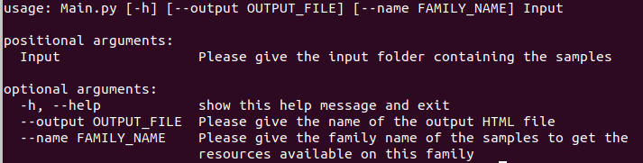
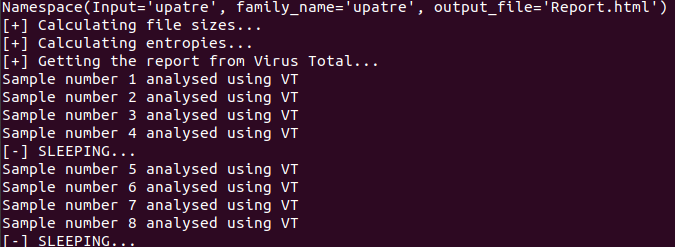
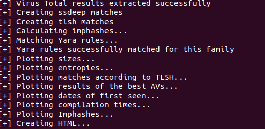

# Forensics
The goal of this project is to write a set of tools that take a number of samples that belong the same family, make an analysis on these samples and generate a number of plots that are displayed in a report page (HTML). 

The report generated contains the following information: 
* Size
* Entropy
* Different similarity hashes (ssdeep, tlsh)
* Virustotal vhashes
* Samples compilation times
* Dates of first seen in the wild
* Imphashes
* Number of matches on virustotal 
* AV label consistency
* Links to online resources available on the family 
* Matching yara rules using a set of predefined yara rules

In order to use this tool, we need to install these dependencies: 
```bash
pip3 install -r requirements.txt
```

Other python dependencies need to be installed manually: 
```bash
pip3 install plotly
pip3 install chart_studio
pip3 install ipython
pip3 install google
pip3 install jsondatetime
pip3 install python-tlsh
pip3 install sdhash
```


Then we need to install useful modules for Linux:
* Yara from: https://yara.readthedocs.io/en/stable/gettingstarted.html
* Ssdeep by doing: 
```bash
sudo apt-get install ssdeep
```

In case of problems, please refer to the troubleshooting section. 


We can check the help section of the tool with: 
```bash
Python3 Main.py [name of input samples] -h 
```
Here is the help section: 



We need to put the input samples folder in the same directory as the tool, then we can launch the tool, for example, by doing: 
```bash
Python3 Main.py upatre --output Report.html --name upatre
```
If the dependencies are correcly installed, we can get: 



Then, after all the samples are analyzed with virustotal, we can get: 



A file named "Report.html" is created in the same directory with the analysis of the samples. 

## Troubleshooting

A problem may occur when using yara by the tool after installing it. 
You may get this error: "OSError: /usr/lib/libyara.so: cannot open shared object file: No such file or directory"
This means that the loader is not finding the libyara library which needs to be found located in /usr/lib.
To solve this, you just need to create a softlink from your downloaded libyara.so to /usr/lib/libyara.so.


## Remarks

In this tool, I'm using plotly to plot the charts, and virus total to get information about the samples. I'm using API keys for authentication to use these tools (Not hidden using a config file since this tool is for educative purpose. There is a rate limit in VT and plotly so these API keys cannot be abused for DOS attacks for example). If you prefer, you can use your own plotly and VT accounts, but you can as well use my own API keys to generate the reports. Due to the rate limit of plotly, you cannot generate as much graphs as you want (limit of 100 graphs). 
